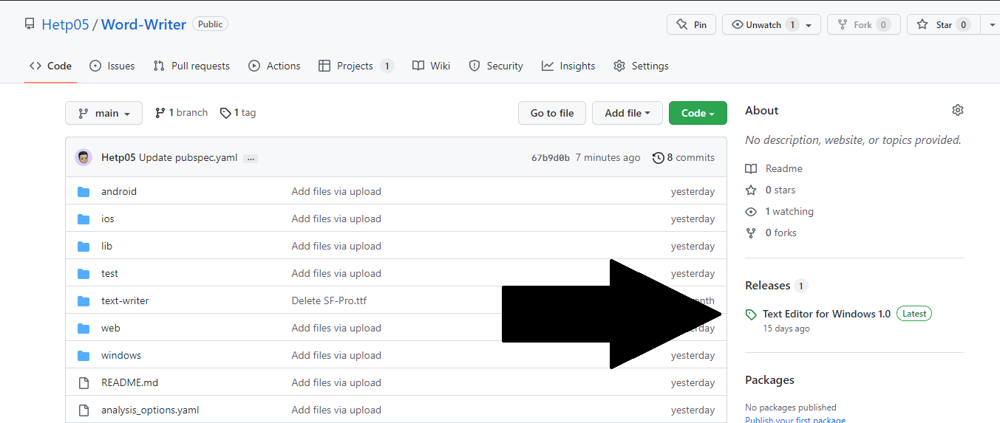
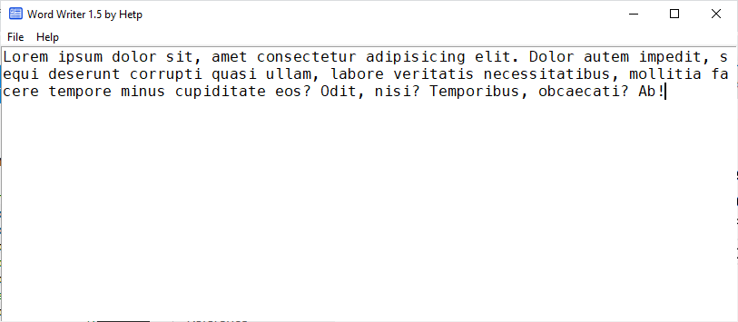

# Word Writer 1.5

> **Warning**
> This project might be perminatly closed, sorry

Word Writer is a simple light `.txt`/ plain text editor.

## Getting Started

Download the .exe file as shown in the steps below.

And start writing your srcipts and stuff.

## User Guide

To download second and final version of Text-Writer.

### Step 1

Head-over to "Releases" section on the right side of the screen:

### Step 2

And dowload .exe at bottone "Assets" Section.

Or just simply go to this [link to get .exe file](https://github.com/Hetp05/Word-Writer/releases/download/text-editor/text-writer.exe).

Then Down exe at normally.

### Step 3

Note it down...

:)

### Warning

- Your anti virus might say "this file might be harmful for your pc" bit this not true, it safe.

- This app might not save to your compter so while tjhis app is running just "Pin it to the taskbar".
