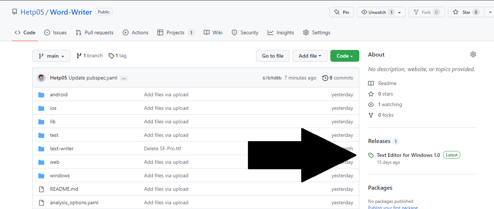

# Word Writer 1

Word Writer is a simple light .txt/ plain text editor.

## Getting Started

This project is a starting point for a Flutter application.

A few resources to get you started if this is your first Flutter project:

- [Lab: Write your first Flutter app](https://docs.flutter.dev/get-started/codelab)
- [Cookbook: Useful Flutter samples](https://docs.flutter.dev/cookbook)

For help getting started with Flutter development, view the
[online documentation](https://docs.flutter.dev/), which offers tutorials,
samples, guidance on mobile development, and a full API reference.

## User Guide

To download first version of Text-Writer.

### Step 1

Head-over to "Releases" section on the right side of the screen:

### Step 2

And dowload .exe at bottone "Assets" Section.

Or just simply go to this [link to get .exe file](https://github.com/Hetp05/Word-Writer/releases/download/text-editor/text-writer.exe).

Then Down exe at normally.

### Warning

- Your anti virus might say "this file might be harmful for your pc" bit this not true, it safe.

- This app might not save to your compter so while tjhis app is running just "Pin it to the taskbar".
